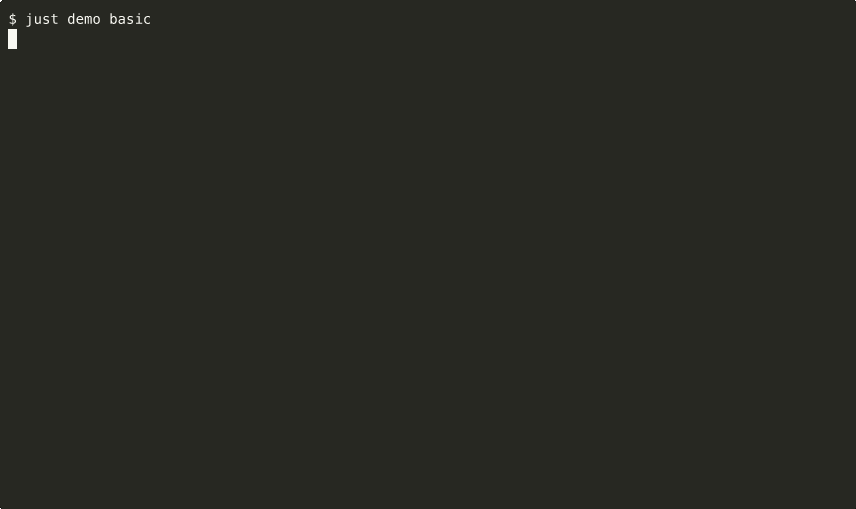
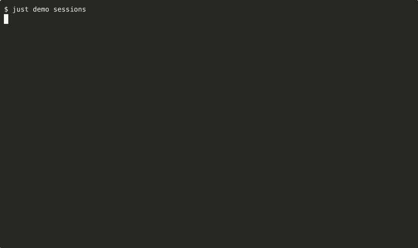
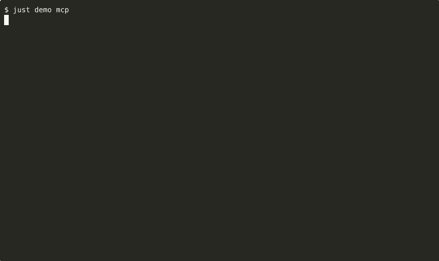
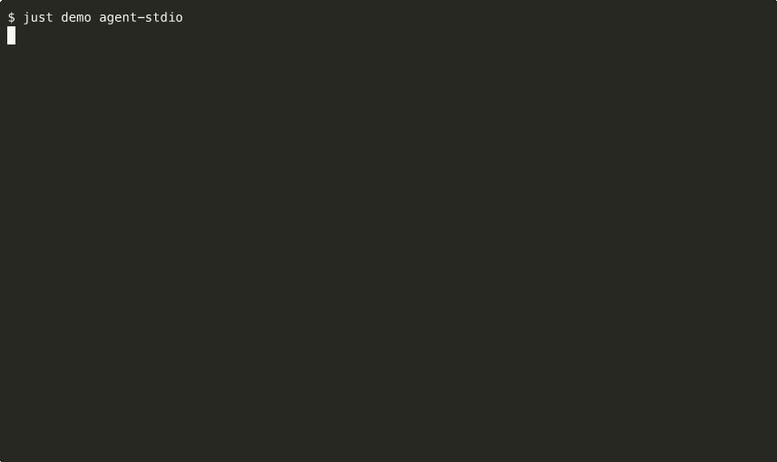

# Grok Go SDK - Interactive Demos

Each demo is a runnable example under `examples/<name>/main.go`. Demos
exist as the SDK's real-binary verification surface: if a demo cannot
produce useful output against a real `grok` install, the SDK is broken.

## Prerequisites

- `grok` installed on PATH and authenticated via `grok login`.
- `just` to run the recipes.
- `go` 1.26.1+ to build the examples.

## Available demos

| Demo                            | Demonstrates                              | Recipe                       | In default GIF set |
|---------------------------------|-------------------------------------------|------------------------------|--------------------|
| [Basic](#basic)                 | Single JSON-output prompt                 | `just demo basic`            | yes                |
| [Streaming](#streaming)         | Channel-driven streaming events           | `just demo streaming`        | yes                |
| [Sessions](#sessions)           | Continue then resume across turns         | `just demo sessions`         | yes                |
| [MCP](#mcp)                     | List configured MCP servers + doctor      | `just demo mcp`              | yes                |
| [Agent stdio](#agent-stdio)     | Full ACP/JSON-RPC 2.0 session             | `just demo agent-stdio`      | yes                |
| [Subagents](#subagents)         | Inline `--agents` JSON, routed prompt     | `just demo subagents`        | yes                |
| [Worktree](#worktree)           | `-w` worktree session with cleanup        | `just demo worktree`         | no (mutates state) |
| [Best-of-N](#best-of-n)         | 4-way headless race                       | `just demo best-of-n`        | no (4x cost)       |
| [Check loop](#check-loop)       | Self-verifying response                   | `just demo check-loop`       | no (slow)          |
| [Agent runtime](#agent-runtime) | Embedded REPL with plugins + budget       | `just demo agent-runtime`    | no (REPL)          |

The `pkg/grok/dangerous` subpackage is intentionally excluded so users do
not accidentally invoke bypass shortcuts.

## GIF generation

GIFs live under `docs/gif/<demo>.gif` and are produced from real grok runs.

```
just demo gif basic        # record one demo
just demo gif-all          # record the cheap default set
just demo gif-list         # list demos
```

The recording pipeline is `asciinema` → `agg`. The `agent-runtime` demo is
driven via an `expect` script (`scripts/demo-expect/agent-runtime.exp`)
because it reads stdin. Required tools:

```
brew install asciinema just expect
cargo install --git https://github.com/asciinema/agg
```

Each recording runs in a fresh temp-directory sandbox. Real grok API
credits are consumed; the default set is the cheap subset.

---

## Basic

**Single JSON-output prompt.**

The simplest possible round-trip: build a client, run one prompt, print the response.



Key features:
- `grok.NewClientFromPath()` locates the binary on `$PATH`.
- `RunPrompt(prompt, &RunOptions{Format: JSONOutput})` returns a typed `*GrokResult`.
- Access `Text`, `SessionID`, `RequestID` directly.

Run it: `just demo basic`

---

## Streaming

**Channel-driven streaming events.**

Consume newline-delimited JSON events from grok's `--output-format streaming-json` transport. Print per-token text as it arrives.


Key features:
- `StreamPrompt(ctx, prompt, opts)` returns `(<-chan Event, <-chan error)`.
- Filter on `Event.Type == grok.EventText` and use `Event.Content()` for text content.
- Context cancellation kills the underlying grok process with SIGTERM then SIGKILL after a 2s grace window.

Run it: `just demo streaming`

---

## Sessions

**Continue then resume.**

Two-turn conversation where the second turn references the first via session ID.



Key features:
- `RunPromptCtx` returns a `SessionID` on the result.
- `ResumeConversationCtx(ctx, prompt, sessionID)` resumes that conversation.
- Session memory is server-side; only the session ID needs to travel.

Run it: `just demo sessions`

---

## MCP

**List configured MCP servers and run doctor.**



Key features:
- `MCPList(ctx)` parses `grok mcp list` into `[]MCPServerConfig`.
- `MCPDoctor(ctx)` returns the diagnostic report even when one or more servers fail their handshake (grok exits non-zero in that case).

Run it: `just demo mcp`

---

## Agent stdio

**Full ACP / JSON-RPC 2.0 long-running session.**

Three turns over a single persistent `grok agent stdio` session. The third turn references the first to prove session memory.



Key features:
- `StartStdioAgent(ctx, nil)` spawns the agent process.
- `Initialize` → `Authenticate("cached_token")` → `NewSession(cwd, nil)` → `PromptText(ctx, sessionID, text)` per turn.
- `s.Updates()` streams `session/update` notifications (`agent_message_chunk`, `agent_thought_chunk`, etc.) as the agent responds.
- `PromptResult.Meta` carries `TotalTokens`, `InputTokens`, `OutputTokens`, `CachedReadTokens`, `ReasoningTokens`, `ModelID`.

Run it: `just demo agent-stdio`

---

## Subagents

**Inline `--agents` JSON; route a prompt to a named agent.**


Key features:
- Define agents inline: `map[string]*grok.SubagentConfig{"security": {...}}`.
- Pick one with `RunOptions{Agent: "security", Agents: agents}`.
- Per-agent tools, prompt, and model.

Run it: `just demo subagents`

---

## Worktree

**`-w` worktree session with cleanup.**

Creates a grok worktree, runs a prompt in it, removes the worktree on exit.

Key features:
- `RunOptions{Worktree: grok.WorktreeOption{Enabled: true, Name: ...}}`.
- `WorktreeRemove(ctx, []string{name}, true, false)` in a `defer` cleans up state even on prompt failure.

Run it: `just demo worktree`

Not in the default GIF set: mutates real worktree state.

---

## Best-of-N

**N parallel grok calls; grok picks the best.**

Key features:
- `RunOptions{BestOfN: 4}` spawns 4 parallel completions.
- Cost scales linearly with `N`; cap with `MaxBudgetUSD`.

Run it: `just demo best-of-n`

Not in the default GIF set: 4x baseline cost per recording.

---

## Check loop

**Self-verifying response.**

Key features:
- `RunOptions{Check: true}` runs grok's self-check pass.
- Slower than baseline; cap with `MaxBudgetUSD` and `Timeout`.

Run it: `just demo check-loop`

Not in the default GIF set: multiple grok passes per call, slow.

---

## Agent runtime

**Embedded long-running agent host pattern.**

A composable starting template for higher-level agent runtimes. Wires a
persistent stdio session with the `LoggingPlugin`, `MetricsPlugin`,
`AuditPlugin`, and `ToolFilterPlugin`. Reads prompts from stdin, prints
streamed responses to stdout.

Key features:
- `PluginManager.Register(...)` for each built-in plugin.
- `BudgetTracker` with warning + exceeded callbacks.
- `StartStdioAgent` + per-turn `PromptText` calls share one session.

Run it: `just demo agent-runtime`

Not in the default GIF set: REPL; GIF requires the
`scripts/demo-expect/agent-runtime.exp` script which drives two short
turns then closes stdin.
